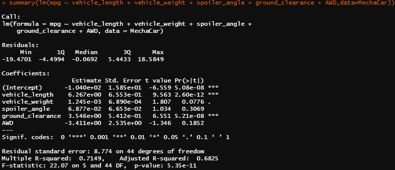

# MechaCar_Statistical_Analysis

## Linear Regression to Predict MPG
To determine what variable is able to predict MPG, we ran a linear regression using all 6 variables to determine what variable has the most significance. When evaluating the graphic below, vehicle_length and ground_clearance were the two most significant variables to predict mpg. We can determine the slope of the model is not 0 when we evaluate the p-value, which is 5.35X-11. Therefore we can reject the null hypothesis. In summary, based on the adjusted r-squared, our model can predict 68% of the variance.

## Summary Statistics on Suspension Coils
The design specifications for the MechaCar suspension coils dictate that the variance of the suspension coils must not exceed 100 pounds per square inch. When we look at the summary of all Lots manufactured, it shows the variance of the coils is roughly 62.9 PSI, which means it's appropriate. 

However, upon futher review of the individual lots, we can determine that Lot3 has exceeded the variance at 170 PSI. This means Lot3 is not an ideal design spec and the team should focus on utilizing Lot 1 and Lot 2.

