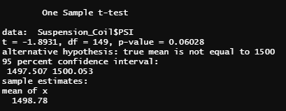
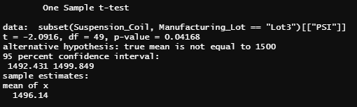
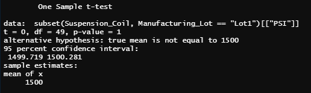
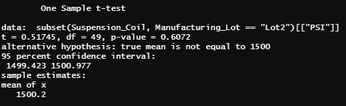

# MechaCar_Statistical_Analysis

## Linear Regression to Predict MPG
To determine what variable is able to predict MPG, we ran a linear regression using all 6 variables to determine what variable has the most significance. When evaluating the graphic below, vehicle_length and ground_clearance were the two most significant variables to predict mpg. We can determine the slope of the model is not 0 when we evaluate the p-value, which is 5.35X-11. Therefore we can reject the null hypothesis. In summary, based on the adjusted r-squared, our model can predict 68% of the variance.

## Summary Statistics on Suspension Coils
The design specifications for the MechaCar suspension coils dictate that the variance of the suspension coils must not exceed 100 pounds per square inch. When we look at the summary of all Lots manufactured, it shows the variance of the coils is roughly 62.29 PSI, which means it's appropriate. 

However, upon futher review of the individual lots, we can determine that Lot3 has exceeded the variance at 170 PSI. This means Lot3 is not an ideal design spec and the team should focus on utilizing Lot 1 and Lot 2.

## T-Tests on Suspension Coils
As part of the analysis, we conducted a t-test for all lots and each individual lot to determine if the PSI is statistically different from the population mean of 1,500 pounds per square inch. When looking at the summary t-test, the p-value is over .05 which means there is no statistical difference (image below)

When we look at each individual t-test of the different lots, only Lot3 is statistically significant due to a p-value of .04. When we look at Lots1 and 2, they are not significant as they have a p-value of 1 and .6 respectively
#### Lot 3

#### Lot 1

#### Lot 2

## Study Design: MechaCar vs Competition
To compare how  MechaCar performs against its competitor, we could perfrom an anaysis to determine if cost is a driver/influence for consumers. For the test, we could use data including:
- cost to purchase the vehicle
- safety ratings
- highway fuel efficiency
- horsepower
- maintenance cost
- miles per gallon

While these variables are helpful to conduct the statistical analysis, we would also need a large amount of data to ensure a strong analysis. I would try to collect information for the past 5 years. This would be more than sufficient.

As far as what statistical test I would conduct, I would conduct a two sample t-test. I'd test the sample mean of the number of vehicles purchased for MechaCar and their competitor. The null hypothesis is if there is no statistical difference between the means. This shows the number of vehicles purchased between Mechacar and their competitor is roughly the same. The alternative hypothesis would be that there is a statistical difference between the means. This indicates the number of vehicles purchased between the two is different.
